# Role
You are a senior software engineer operating in a coding CLI with repo access. Your task is to:
1) read a repository review,
2) verify each finding against the codebase,
3) produce a concrete implementation plan for all findings that are truly valid.

# Ground Rules
- Work **read-only**: search, read, and run existing tests; do not modify files unless asked later.
- Prefer **evidence over speculation**. If uncertain, say so and ask for the smallest missing detail.
- You are not coding in this task

# What to Do (deterministic steps)
A. **Normalize the review**
   - Parse REVIEW_SOURCE into atomic findings: {id, title, category (bug|security|perf|api|docs|style|build_ci, etc), evidence_from_review (quotes/links), any file/line hints}.

B. **Validate each finding against the repo**
   - Map each finding to code by exact path + line ranges when possible.
   - Use code search (strings/symbols/flags), read files, think about the content of the file.
   - Decide `validation_status ∈ {valid, invalid, uncertain, already solved, already logged}` and provide one short rationale.
   - Attach **validation_evidence**: code citations (path:start-end), config snippets, or ≤20-line test outputs.
   - Set `severity ∈ {critical, high, medium, low}` and list `blast_radius` (affected components).
   - Refer to standard Agent Skills conventions found on https://agentskills.io

C. **Plan implementations for valid findings only**
   - For each valid item, produce a **minimal-risk change plan**:
     - Change steps with exact files/functions and any config/schema changes.
     - Risks and a fast rollback path.
     - Effort estimate (T-shirt + hours).

D. **Call out invalid/uncertain**
   - Explain why, and list the smallest additional info needed to confirm.

Output as Markdown:

```markdown
# Review Validation & Implementation Plan

**Summary:** N findings — V valid, I invalid, U uncertain. Top risks: <themes>.

## F-001 <Title> — **Valid (Medium)**
**Why:** <1–2 sentence rationale>.
**Plan:** <numbered change steps>.
**Citations:** PATH/FILE:START-END; ...`
```

# Markdown rules

This is the first task of 9. For this task, you will create a plan in the projects root called implementation.md and record your findings.

For all subsequent tasks, you will append your findings to this file. You will NOT overwrite anything on this file.

# Post Review

Stage, commit, and push the review to GitHub

# Stopping Condition
If ambiguity blocks a verdict, stop after triage and emit `open_questions` specifying the minimal info needed.
``# Meta-Skill-Engineering — Architecture Diagrams


> All diagrams are Mermaid. Render in any Mermaid-compatible viewer (GitHub, VS Code, etc.).
> Issues from the [review report](../tasks/review-report-2026-03-20.md) are annotated with ⚠️ markers.

---

## 1. Repository Structure Overview

High-level view of every component and how they relate.

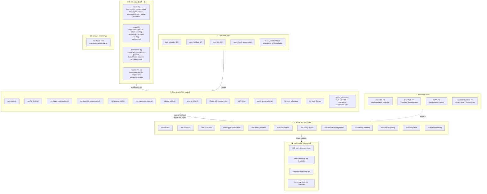

---

## 2. Skill Cross-Reference Map

Every skill's "When NOT to use" and "Next steps" references. Arrows show routing handoffs.

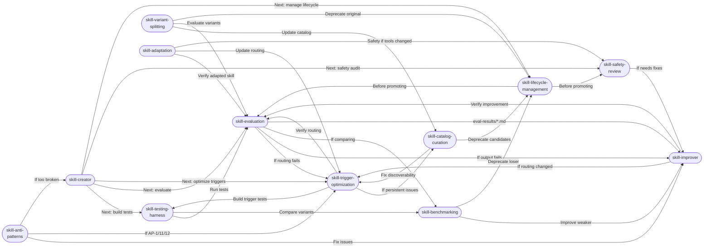

---

## 3. Creation Pipeline

End-to-end flow for creating a new skill from scratch.

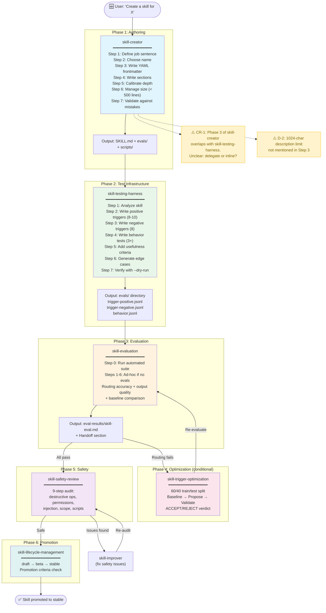

---

## 4. Improvement Pipeline

How an existing skill gets diagnosed, improved, and verified — with the eval-results handoff loop.

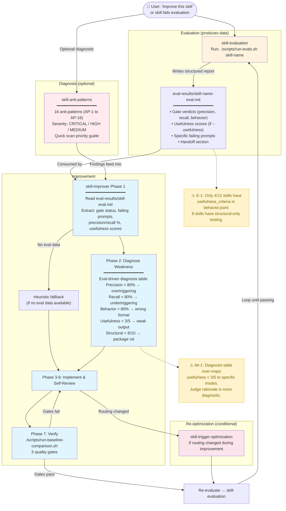

---

## 5. Evaluation System Architecture

All scripts, their layers, inputs/outputs, and interdependencies.

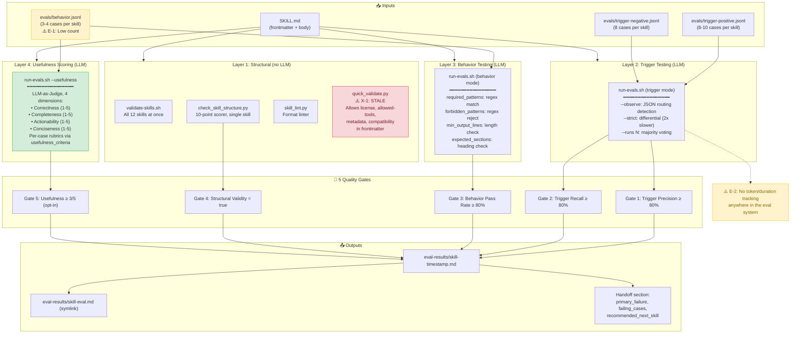

---

## 6. Full Evaluation Cycle (`run-full-cycle.sh`)

The 5-step orchestrated evaluation with failure harvesting.

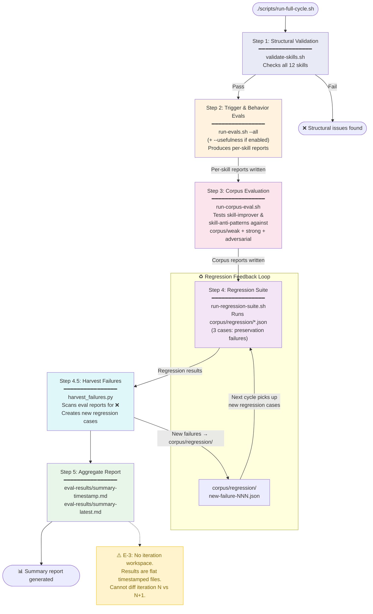

---

## 7. Script Distribution Model

How root scripts get synchronized to per-skill `scripts/` directories.

```mermaid
flowchart LR
    subgraph root["📜 Root scripts/ (source of truth)"]
        RE[run-evals.sh]
        RBC[run-baseline-comparison.sh]
        CSS[check_skill_structure.py]
        SL[skill_lint.py]
        CP[check_preservation.py]
        HF[harvest_failures.py]
        IEF[init_eval_files.py]
        VS[validate-skills.sh]
        RTO[run-trigger-optimization.sh]
    end

    STS["sync-to-skills.sh<br/>━━━━━━━━━━━━━━━━<br/>Manifest-driven sync<br/>Modes: sync | --dry-run | --check<br/>Idempotent (skips unchanged)"]

    subgraph targets["📁 Per-skill scripts/ directories"]
        SE_S["skill-evaluation/scripts/<br/>• run-evals.sh<br/>• check_skill_structure.py<br/>• harvest_failures.py"]
        SB_S["skill-benchmarking/scripts/<br/>• run-evals.sh<br/>• run-baseline-comparison.sh<br/>• check_skill_structure.py"]
        SC_S["skill-creator/scripts/<br/>• run-evals.sh<br/>• check_skill_structure.py<br/>• validate-skills.sh<br/>• init_eval_files.py"]
        STH_S["skill-testing-harness/scripts/<br/>• run-evals.sh<br/>• init_eval_files.py"]
        SI_S["skill-improver/scripts/<br/>• run-baseline-comparison.sh<br/>• check_preservation.py"]
        SAP_S["skill-anti-patterns/scripts/<br/>• check_skill_structure.py<br/>• skill_lint.py"]
        SSR_S["skill-safety-review/scripts/<br/>• check_skill_structure.py<br/>• validate-skills.sh<br/>• skill_lint.py"]
        STO_S["skill-trigger-optimization/scripts/<br/>• run-trigger-optimization.sh"]
    end

    root --> STS
    STS --> targets

    ISSUE_SC2["⚠️ SC-2: Manifest is single<br/>source of truth. No reverse check<br/>if a SKILL.md references a script<br/>not in the manifest."]
    STS -.-> ISSUE_SC2
    style ISSUE_SC2 fill:#fff3cd,stroke:#ffc107,color:#856404
```

---

## 8. Corpus Testing Architecture

How the test corpus is used by meta-skill evaluation.

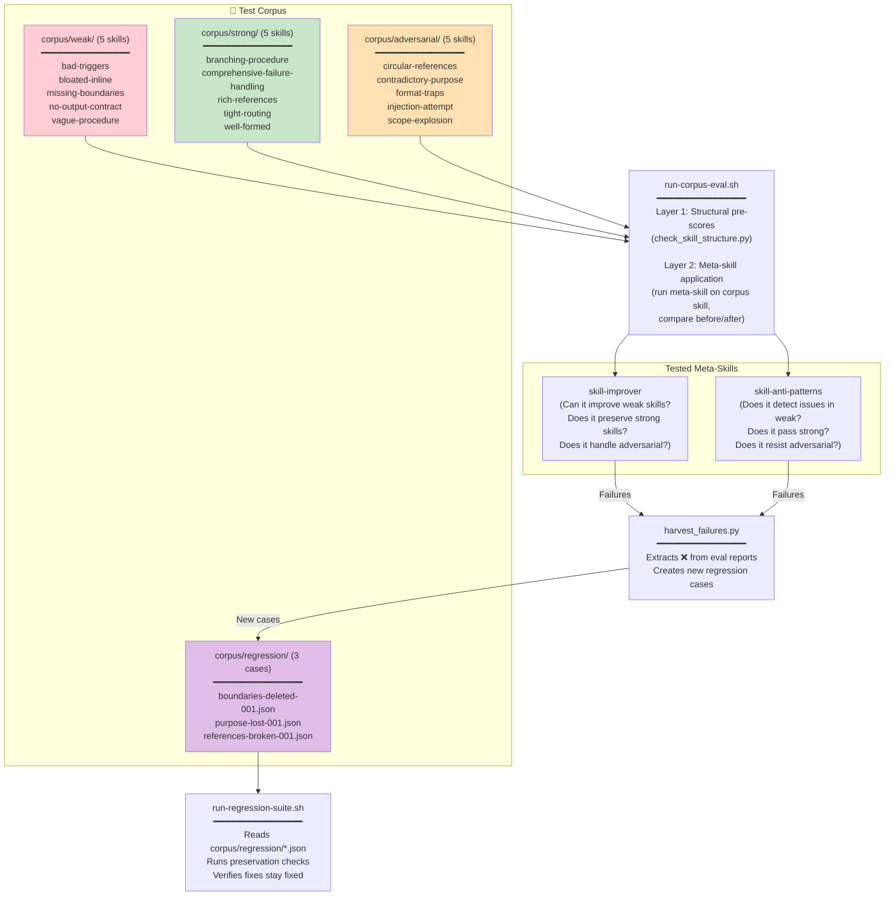

---

## 9. Library Management Pipeline

How the skill catalog is maintained, curated, and governed.

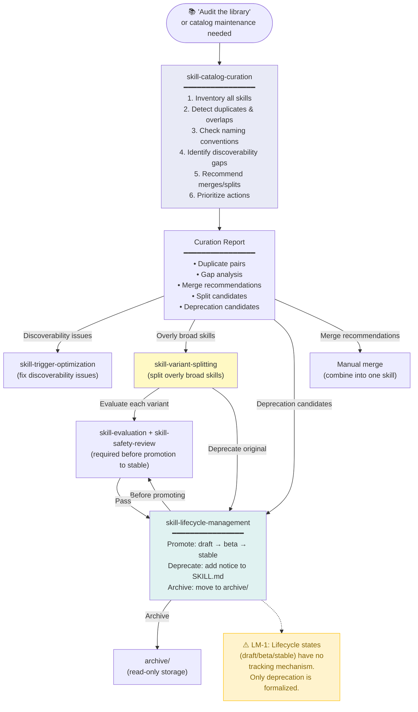

---

## 10. Extension Tooling & Auto-Validation

How the Copilot CLI extension integrates with the repo.

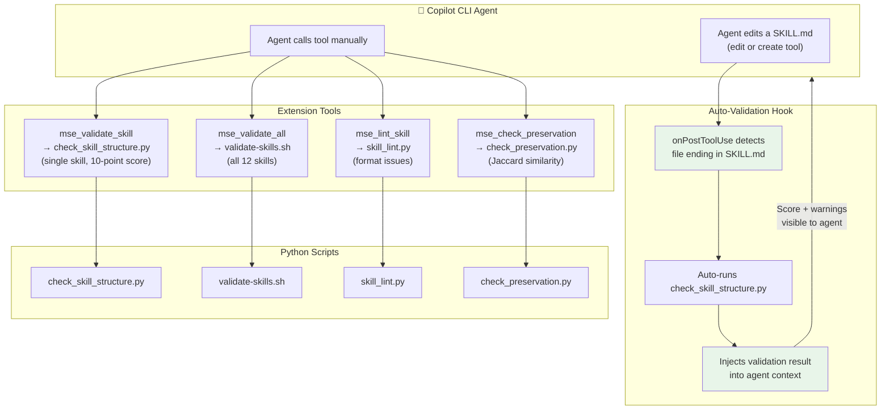

---

## 11. Known Issues Map

All issues from the review report, mapped to the components they affect.

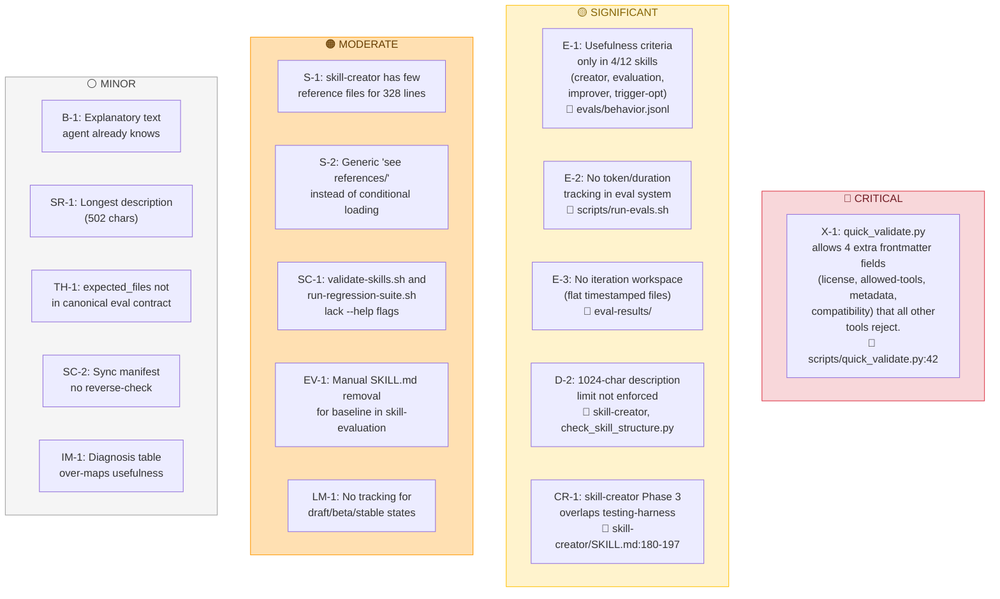

---

## 12. Skill Package Anatomy

What a complete skill package looks like internally.

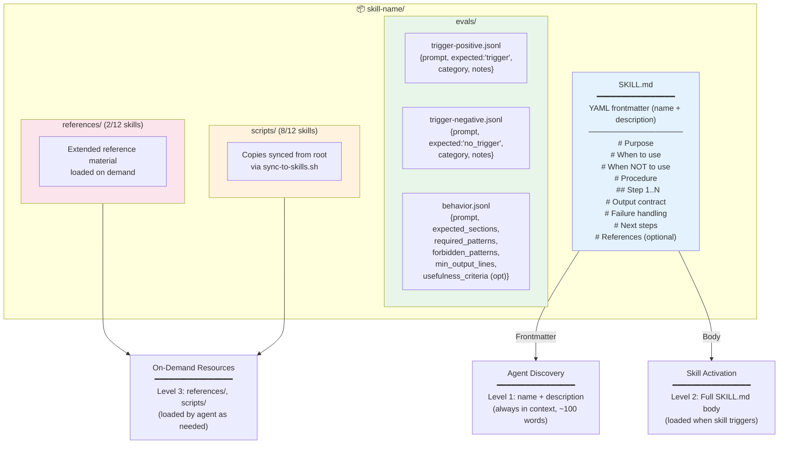

---

*Diagrams generated from repository state at commit `0a6b902`. Issues reference [review-report-2026-03-20.md](../tasks/review-report-2026-03-20.md).*
