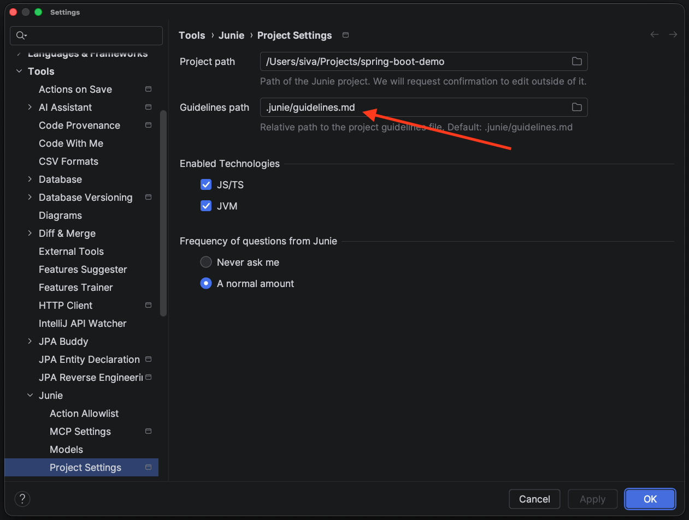

# Junie Guidelines

  

A catalog of technology-specific guidelines for optimizing Junie code generation.

[Junie](https://www.jetbrains.com/junie/) is an AI agent for JetBrains IDEs including [IntelliJ IDEA](https://www.jetbrains.com/idea/), [PyCharm](https://www.jetbrains.com/pycharm/), [WebStorm](https://www.jetbrains.com/webstorm/), [GoLand](https://www.jetbrains.com/go/), [PhpStorm](https://www.jetbrains.com/phpstorm/), [RubyMine](https://www.jetbrains.com/ruby/), [RustRover](https://www.jetbrains.com/rust/) and [Rider](https://www.jetbrains.com/rider/).

## Purpose of the guidelines?
These guidelines capture the coding conventions and best practices your team agrees to follow.

They can be provided to AI agents so that any generated code aligns with your standards.

Beyond AI-assisted development, they serve as a reference for developers to learn common practices and understand the reasoning behind them.

These guidelines cover:

* Preferred coding styles and naming conventions
* Recommended best practices
* Common antipatterns to avoid
* Real-world code examples accompanied by clear explanations

## How to use the guidelines in Junie?
You can define your coding style, best practices, and general preferences in `.junie/AGENTS.md` or `AGENTS.md`.
Alternatively, you can specify a custom path to the guidelines in the IDE settings (Settings | Tools | Junie | Project Settings).

For more information,
see [Junie Documentation](https://junie.jetbrains.com/docs/guidelines-and-memory.html).

## Table Of Contents

- [Junie Guidelines ](#junie-guidelines)
    - [How to use the guidelines in Junie?](#how-to-use-the-guidelines-in-junie)
    - [Contents](#table-of-contents)
    - [Guidelines](#guidelines-catalog)
        - [Java](#java)
        - [Python](#python)
        - [Go](#go)
    - [Contributing](#contributing)

## Guidelines Catalog

### Java
* [Java](/guidelines/java/java/guidelines.md) [(with Explanations)](/guidelines/java/java/guidelines-with-explanations.md)
* [Spring Boot](/guidelines/java/spring-boot/guidelines.md) [(with Explanations)](/guidelines/java/spring-boot/guidelines-with-explanations.md)

### TypeScript
* [Nuxt](/guidelines/typescript/vue/nuxt/guidelines.md) [(with Explanations)](/guidelines/typescript/vue/nuxt/guidelines-with-explanations.md)

### Python
* [Django](/guidelines/python/django/guidelines.md) [(with Explanations)](/guidelines/python/django/guidelines-with-explanations.md)

### Go
* [Gin-Gonic](guidelines/go/gin/guidelines.md) [(with Explanations)](guidelines/go/gin/guidelines-with-explanation.md)

## Contributing
Contributions are always welcome! Please check out the [contributing guidelines](/CONTRIBUTING.md).
